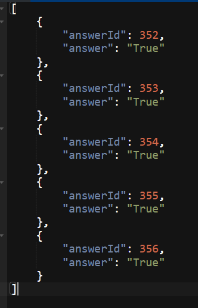

# Five Questions App
5-Question Quiz App

## Technologies
- Java Spring Boot
- MySQL database
- Angular 17

## How to test the Backend
Once the frontend is still not implemented properly, the endpoints should be reached by using an API-platform client like Postman or Boomerang (Chrome extention).

Step 1: Get 5 questions from data from the TRIVIA DB API
        Endpoint: http://localhost:8080/api/fetch

Step 2: Get the questions from a MySQL database. Each question contains only two properties: id and question text.
        Endpoint: http://localhost:8080/api/questions
        
Step 3: Submit the answers and get score as an integer response.
        By comparing with the json response in the 1st step, you can full the body to check if the score matches to the correct answers.
        Endpoint: http://localhost:8080/api/answers/submit

Answer's body looks like this:
        

## author
[Igor Figueiredo](https://github.com/Igor-GF)

## Credits
[Terry Martin - Udemy course](https://www.udemy.com/course/neutrino-java-foundations/)

## Project status
Frontend is still not working... in progress.

## License
[MIT](https://choosealicense.com/licenses/mit/)